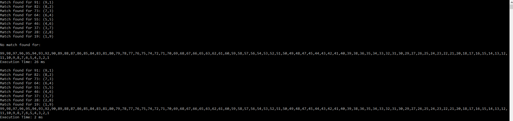

# Technical-Interview

An output challenge for a technical interview:
I timed using string builder or using += for string outputs and String builder was much quicker 

#
The top output uses normal strings which are recreated with each += and this took 26 ms.

The bottom ouput uses StringBuilder which was much quicker - 2ms. 

